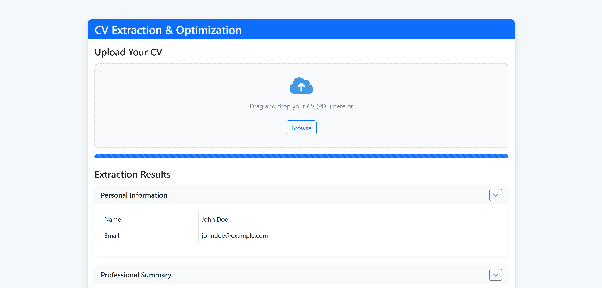

# 📄 CV Optimization API

This API enables extraction, structuring, and intelligent optimization of resumes based on job postings. It's built on a modern FastAPI backend and leverages AI technologies like OCR, LangChain, HuggingFace, or Ollama.



---

## 🔧 Architecture Overview

| Stage                                                       | Description                                                                               | Resources                                                                                                                                          |
| ----------------------------------------------------------- | ----------------------------------------------------------------------------------------- | --------------------------------------------------------------------------------------------------------------------------------------------------- |
| 🧠 **Backend (FastAPI)**                                    | Modern Python framework - fast, typed, and scalable                                       | 📚 [FastAPI Documentation](https://fastapi.tiangolo.com/)                                                                                           |
| 📝 **Content Extraction (Docling, RapidOCR)**               | Fast OCR optimized for semi-structured documents (resumes)                                | 📚 [Docling GitHub](https://github.com/docling-ai/docling), [RapidOCR GitHub](https://github.com/RapidAI/RapidOCR)                                  |
| 📦 **CV → JSON Conversion (LLM via LangChain + HF/Ollama)** | Transformation of free text into structured, standardized JSON schema                     | 📚 [LangChain Docs](https://docs.langchain.dev/), [HuggingFace Hub](https://huggingface.co/models)                                                  |
| 🎯 **CV Optimization (LLM)**                                | Resume adjustment based on job postings to maximize relevance                             | 📚 [McKinsey - AI in Recruiting](https://www.mckinsey.com/capabilities/people-and-organizational-performance/our-insights/the-future-of-recruiting) |
| 🔁 **Standardized JSON Output**                             | Facilitates frontend integration, rendering, and document generation                      | —                                                                                                                                                   |
| 🖥️ **Frontend (Static then Next.js)**                      | Currently pure HTML/CSS/JS. Migration to Next.js (App Router) planned.                    | 📚 [Next.js Documentation](https://nextjs.org/)                                                                                                     |

---

## 🚀 Why This Project Matters

* ✅ **Robust stack** with no exotic dependencies
* 💼 **Tangible impact** on users' employability
* 🔄 **Scalable**: Potential extensions to cover letters, scoring, portfolios...
* 🤖 **Targeted AI use**: Smart alignment with job postings and intelligent structuring

---

## 🔮 Frontend Roadmap

| Phase    | Content                                                                 |
| -------- | ---------------------------------------------------------------------- |
| ✅ Current | Static frontend (HTML, CSS, JS) in `app/static/`                       |
| 🔜 Future | Migration to **Next.js** with App Router (upload, preview, scoring…)   |

---

## 🛠️ Recommendations

### 1. Strict JSON Schema (via Pydantic)

* `personal_info`: name, email, phone
* `experiences`, `skills`, `education`, `certifications`, `languages`

### 2. Recommended LLM Models

* **Hugging Face**: Mixtral, T5/T0, Mistral
* **Ollama**: Llama3, Mistral (local) for privacy and performance

### 3. Frontend

* Build these pages with **Next.js**:
  * Resume upload
  * Job posting selection
  * Optimized resume preview (Word/PDF export)

---

## ✨ Features

* 🔍 OCR parsing of resumes (PDF)
* 🧠 Job posting-aligned optimization
* 📊 Clean JSON structuring for frontend consumption
* 📈 Future possibilities: scoring, PDF/Word export

---

## ⚙️ Installation

### Prerequisites

* Python ≥ 3.9
* [Tesseract OCR](https://github.com/tesseract-ocr/tesseract)
* [Ollama](https://ollama.ai/) (optional for local LLM)

### Installation

```bash
git clone https://github.com/yourusername/cv-optimization-api.git
cd cv-optimization-api

python -m venv venv
source venv/bin/activate  # Windows: venv\Scripts\activate

pip install -r requirements.txt
```

Download an Ollama model:

```bash
ollama pull llama3
```

---

## 🧪 Usage

### Launch the API

```bash
python app/main.py
```

* Swagger: [http://localhost:8000/docs](http://localhost:8000/docs)
* ReDoc: [http://localhost:8000/redoc](http://localhost:8000/redoc)

### Endpoints

#### 1. `POST /api/process/cv`

Upload a resume (PDF), returns structured JSON.

```bash
curl -X POST "http://localhost:8000/api/process/cv" \
  -H "accept: application/json" \
  -H "Content-Type: multipart/form-data" \
  -F "file=@your_resume.pdf"
```

#### 2. `POST /api/result/optimize`

Send structured JSON + job posting → returns optimized resume.

---

## 📁 Project Structure

```
📁 app
├── main.py
├── api/
│   └── v1/
│       └── endpoints/
│           ├── process.py
│           └── result.py
├── models/
│   └── cv_models.py
├── services/
│   ├── cv_parser.py
│   └── cv_optimizer.py
├── static/
│   ├── css/
│   │   └── styles.css
│   ├── js/
│   │   └── script.js
│   └── index.html
├── temp_files/
└── extracted_markdown/
```

---

## ⚠️ Error Handling

* **400**: Invalid file
* **422**: Validation error
* **500**: Server error (stacktrace in dev)

---

## 🚀 Deployment

```bash
gunicorn -w 4 -k uvicorn.workers.UvicornWorker app.main:app
```

* Add: logging, auth, env management (`pydantic.BaseSettings`)

---